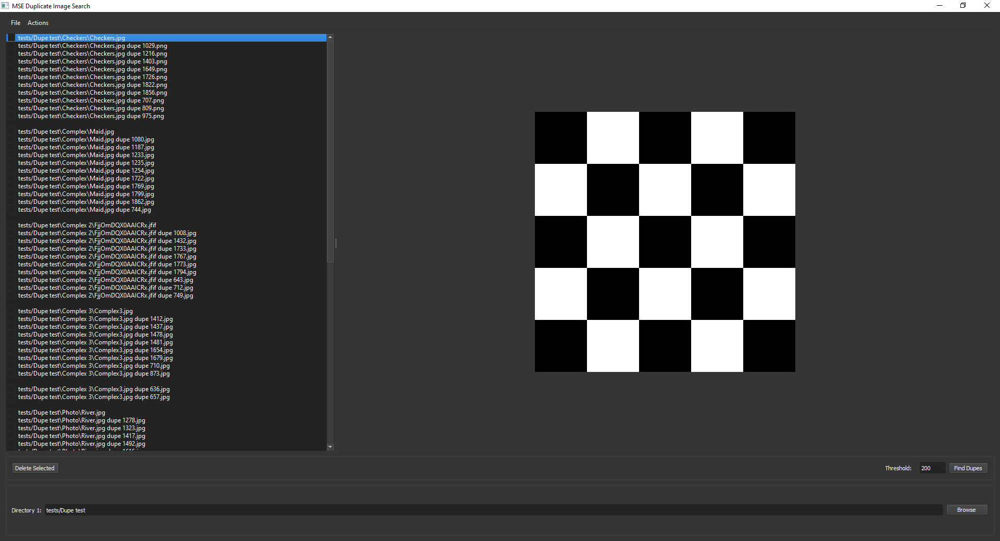

# ImageTwinTracker

An image search tool that locates duplicate images of different sizes.



## Installation and Running
### Prerequisites
+ Python 3.7+
+ Windows 10/11
### Installation on Windows 10/11 using release package
1. Download [ImageTwinTracker-v0.1.1.zip](https://github.com/Vaedrenn/ImageTwinTracker/releases/tag/v0.1.1) from v0.1.1 and extract its contents.
2. Run ImageTwinTracker.exe

### Building from source
Assuming you've already set up the virtual environment
```bash
pip install -r requirements.txt
pip install .
python launch.py
```

## Usage
Choose the directory or folder where you intend to search for duplicates using the browse button, then click "Find Dupes."

### How Image Twin Tracker Works
The "ImageTwinTracker" tool is designed to identify potential duplicate pairs of images based on their Mean Square Error (MSE) values. The Mean Square Error is a numerical metric that quantifies the difference between two images, with lower values indicating greater similarity.

MSE is calculated by taking the average of the squared pixel-wise differences between corresponding pixels in two images. When two images are nearly identical, their pixel values will have minimal differences, resulting in a low MSE value.

### Identifying Duplicates

When using **ImageTwinTracker**, the tool compares images in pairs and computes their MSE values. Images with an MSE of 200 or less are flagged as potential duplicates. Keep in mind that this threshold may vary based on factors such as image content and quality.

### Adjusting Tolerance
If you find that the default tolerance of 200 doesn't suit your specific use case, you can adjust it to be more or less stringent. Experiment with different threshold values to find the setting that works best for your image dataset.
- In general, duplicate images typically have an MSE less than 500 with the average being 200
- Non-duplicate pairs will have an MSE in the tens of thousands

### Multiprocessing

**ImageTwinTracker** supports multiprocessing to accelerate search time.

⚠️ **WARNING**: While adjusting the number of threads can optimize search performance, setting an excessively high number of threads may strain system resources and lead to instability. Please exercise caution and select a reasonable thread count based on your system's capabilities. Overloading the application with threads beyond what your hardware can handle might result in crashes or unresponsive behavior.

- To enable, go to **File** → **Options** and set numbers of threads.


## References
https://towardsdatascience.com/finding-duplicate-images-with-python-71c04ec8051

https://pyimagesearch.com/2014/09/15/python-compare-two-images/
